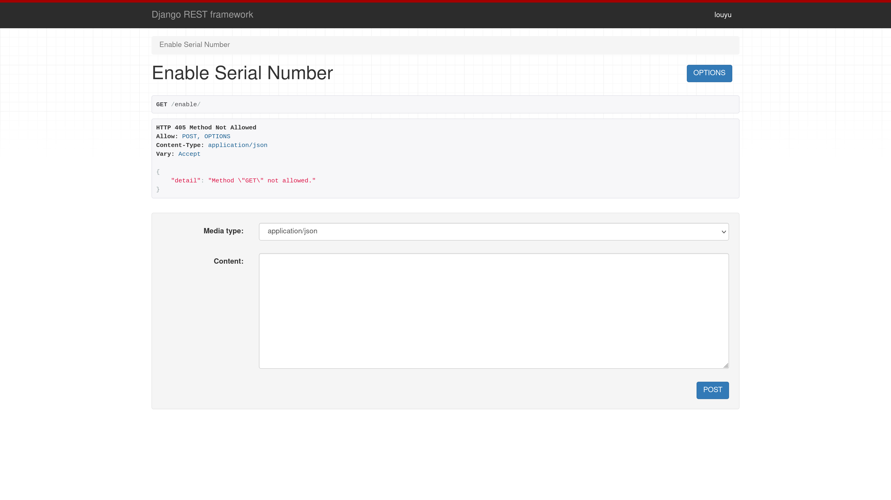
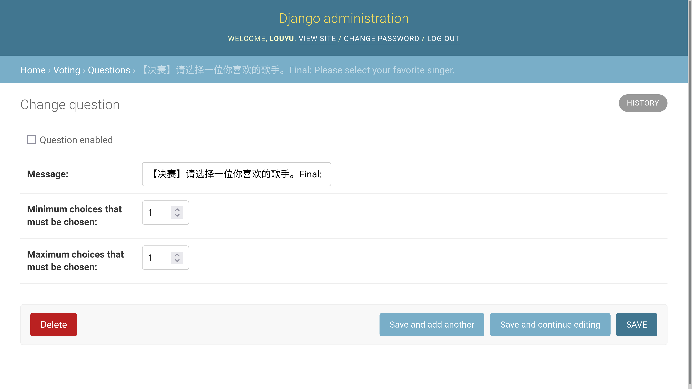
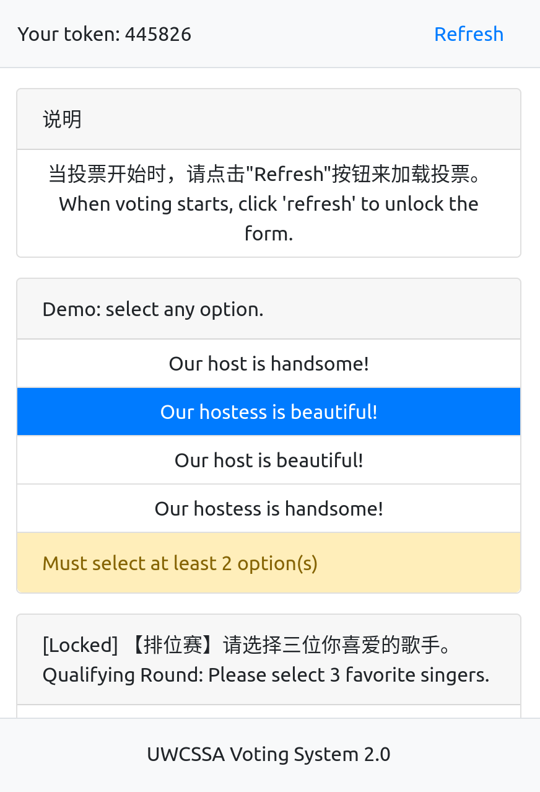
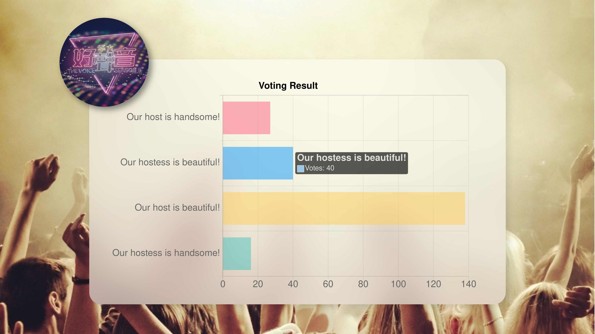

# A Voting Website using React and Django 用 Django 和 React 实现的投票网站

## Introduction 简介

The main function of this website is to allow users cast a vote.
The administrator can show the voting result as a bar chart, usually on a big screen on stage.
The end of this documentation contains some screenshot.

该项目的主要功能是让观众投票。
管理员可以在大屏幕上用柱状图统计投票结果。
文档尾部有一些截图。

## Features 功能

Useful features includes:

* A database editing page that is accessable in web browsers, implemented with Django administration
* A REST API that can both interact with a React UI or used directly through browser with Django REST Framework
* A voting page that automatically synchronize its state with the backend. The user don't need to click a submit button.
* An interactive and live result page using Chart.js
* Unique URLs for each user. This can be embedded in QR codes on each ticket. This enables fast log-in just by scanning the QR code.

主要功能包括：

* 用 Django 管理界面实现的数据库管理页面，可以在浏览器中操作
* 实现了 REST API，可以用前端 UI （React） 访问，或通过 Django REST Framework 直接访问接口
* 观众的选择自动与服务器同步，不需要点击提交
* 用 Chart.js 实现的交互式实时结果界面
* 为每个用户生成独立的 URL，可以作为二维码嵌入门票。扫描二维码即可快速登录。

## How to Use 使用说明

Please refer to the documentation for [client](https://github.com/LouYu2015/voting-client#readme) and [server](https://github.com/LouYu2015/voting-server#readme) on how to deploy them.

You need to have two domains to deploy the website.
One serves the backend API and the other one serves the frontend assets.
You can use subdomains of your main domain.
For the documentation below, replace `api.example.com` with the domain of your backend and `example.com` with the domain of your frontend.

关于如何部署网站，请参阅子目录的说明。

部署网站时需要两个域名，分别提供后端API和前端网页。
您可以用子域名来实现。
以下用 `api.example.com` 表示后端域名，`example.com` 表示前端域名，请替换为自己的域名。

### Adding Voters 添加投票人

You should assign each voter a random serial number to check their identity.
You can generate random numbers with the ticket generator.

您需要给每个用户生成一个序列码，来验证用户身份。
您可以用门票生成器来生成序列码。

To import serial numbers:

* Go to `api.example.com/enable/`. 
* Log in as superuser. 
* Submit the serial numbers as an JSON array of string. 

如要导入序列码：

* 打开 `api.example.com/enable/`
* 用管理员帐户登录。
* 以 JSON 数组格式提交所有序列码。

You can also prevent certain serial numbers from voting by going to `api.example.com/disable/`.

您也可以用 `api.example.com/disable/` 撤销某些序列号的投票权。

### Adding Choices 添加选项

You can edit the database by going to `api.example.com/admin/`.
Edit `Questions` table to add and enable questions.
When a question is disabled (enable field is unchecked), users can't continue to submit any vote for it.
Edit `Choices` table to add choices and link each choice to a question.

您可以在 `api.example.com/admin/` 中修改数据库。
若要添加/启用提问，请修改 `Questions` 表。
提问不启用时，用户不能再给该提问投票。
若要添加选项，请修改 `Choices` 表，把每个选项连接到对应提问下。

### Accessing Voting Page 投票

Each voter can access their voting page by going to `example.com/qr_code/<serial number>` where `<serial number>` is their assigned serial number.
You can using the ticket generator to embed this URL in tickets for convenient access.

投票人可以前往 `example.com/qr_code/<serial number>` 投票，其中 `<serial number>` 是用户的序列码。
您可以把此 URL 用二维码嵌入门票，用户扫码即可登录。

### Accessing Result Page 查看结果

You can access the result page by going to `example.com/view_result/<question id>` where `<question id>` is the ID in `Questions` table.

您可以前往 `example.com/view_result/<question id>` 查看投票结果，其中 `<question id>` 是某个提问在 `Question` 表中的编号。

